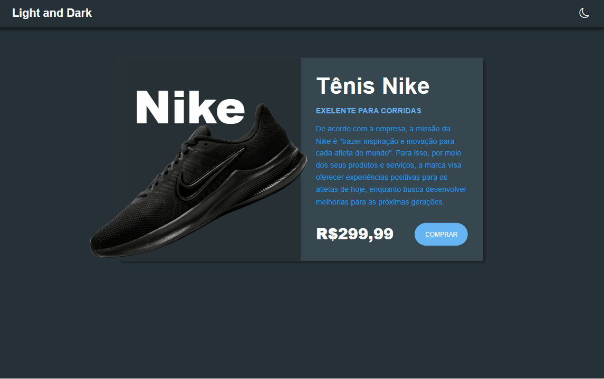

# DarkModeNike 🌓
Page de vendas de Tênis Nike com Efeito Dark ou Light 🌓
#

* Stacks 📚 and Skills 🧠:

    * HTML
        * Tags Semânticas
        * Bibliotécas Externas:
            * [Bootstrap Icons](https://cdn.jsdelivr.net/npm/bootstrap-icons@1.10.1/font/bootstrap-icons.css)
    * CSS
        * Flex-Box
        * Dark and Light
    *  JavaScript 
        * DOM
        * Funções

#

<h3>Page:</h3>

